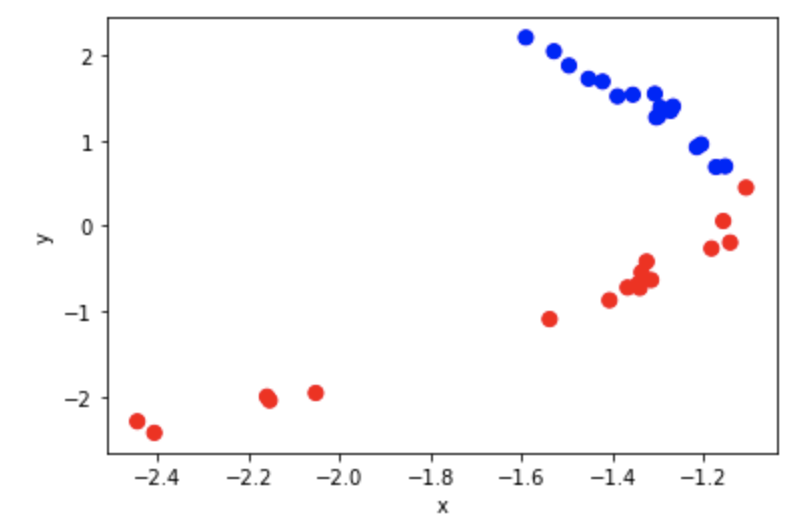
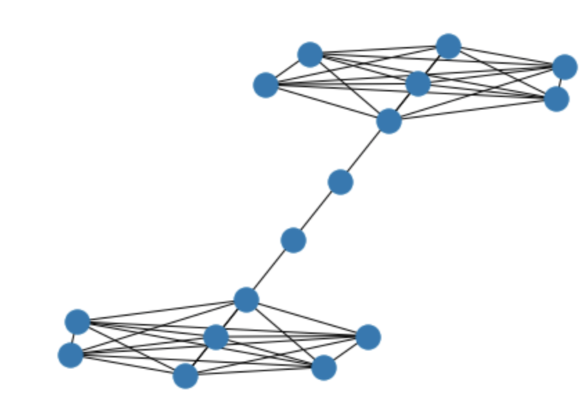
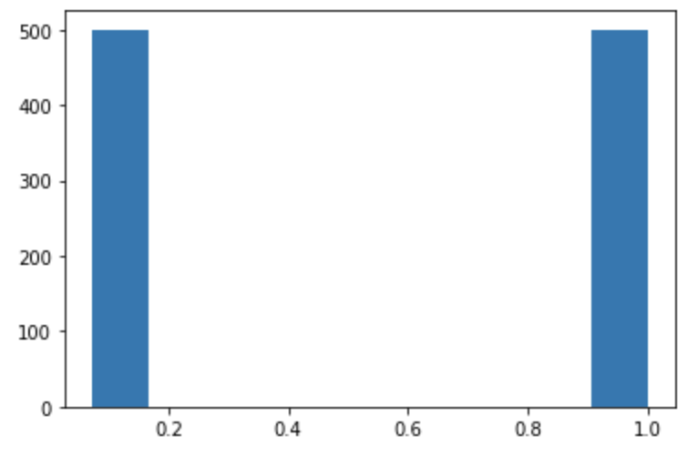

# node2vec

### Setup

First of all, I will install the [graph2vec library](https://github.com/VHRanger/graph2vec) which offers a fast implementation of the node2vec method.


```python
!pip install nodevectors
```

    Collecting nodevectors
      Downloading nodevectors-0.1.23.tar.gz (15 kB)
    Collecting csrgraph
      Downloading csrgraph-0.1.28.tar.gz (14 kB)
    Requirement already satisfied: gensim in /usr/local/lib/python3.7/dist-packages (from nodevectors) (3.6.0)
    Requirement already satisfied: networkx in /usr/local/lib/python3.7/dist-packages (from nodevectors) (2.6.3)
    Requirement already satisfied: numba in /usr/local/lib/python3.7/dist-packages (from nodevectors) (0.51.2)
    Requirement already satisfied: numpy in /usr/local/lib/python3.7/dist-packages (from nodevectors) (1.19.5)
    Requirement already satisfied: pandas>=1.0 in /usr/local/lib/python3.7/dist-packages (from nodevectors) (1.1.5)
    Requirement already satisfied: scipy in /usr/local/lib/python3.7/dist-packages (from nodevectors) (1.4.1)
    Requirement already satisfied: scikit-learn in /usr/local/lib/python3.7/dist-packages (from nodevectors) (0.22.2.post1)
    Requirement already satisfied: python-dateutil>=2.7.3 in /usr/local/lib/python3.7/dist-packages (from pandas>=1.0->nodevectors) (2.8.2)
    Requirement already satisfied: pytz>=2017.2 in /usr/local/lib/python3.7/dist-packages (from pandas>=1.0->nodevectors) (2018.9)
    Requirement already satisfied: six>=1.5 in /usr/local/lib/python3.7/dist-packages (from python-dateutil>=2.7.3->pandas>=1.0->nodevectors) (1.15.0)
    Requirement already satisfied: tqdm in /usr/local/lib/python3.7/dist-packages (from csrgraph->nodevectors) (4.62.3)
    Requirement already satisfied: smart-open>=1.2.1 in /usr/local/lib/python3.7/dist-packages (from gensim->nodevectors) (5.2.1)
    Requirement already satisfied: setuptools in /usr/local/lib/python3.7/dist-packages (from numba->nodevectors) (57.4.0)
    Requirement already satisfied: llvmlite<0.35,>=0.34.0.dev0 in /usr/local/lib/python3.7/dist-packages (from numba->nodevectors) (0.34.0)
    Requirement already satisfied: joblib>=0.11 in /usr/local/lib/python3.7/dist-packages (from scikit-learn->nodevectors) (1.0.1)
    Building wheels for collected packages: nodevectors, csrgraph
      Building wheel for nodevectors (setup.py) ... [?25l[?25hdone
      Created wheel for nodevectors: filename=nodevectors-0.1.23-py3-none-any.whl size=17951 sha256=d0597edda77a3a0e9e6773f8ec04212285ab601618a95f8da17a91ffba954429
      Stored in directory: /root/.cache/pip/wheels/6e/6a/11/ac8620f101db6248c3cd436636eb17f6f7430cd1ac3a3068dc
      Building wheel for csrgraph (setup.py) ... [?25l[?25hdone
      Created wheel for csrgraph: filename=csrgraph-0.1.28-py3-none-any.whl size=17632 sha256=4171ab2821d063ad0e2ea72b8ae60b4a7aaccd233c8bdfcf27ec1056ac1a317d
      Stored in directory: /root/.cache/pip/wheels/3d/0a/58/36a63805f1cd719cbcc5a3c4c109604985a809e7d81bac1649
    Successfully built nodevectors csrgraph
    Installing collected packages: csrgraph, nodevectors
    Successfully installed csrgraph-0.1.28 nodevectors-0.1.23


I now import the library, and create a small wrapper class which will expose only the few hyperparameters I will need to tune in this Colab


```python
import nodevectors
import networkx as nx

class Node2Vec(nodevectors.Node2Vec):
  """
  Parameters
  ----------
  p : float
      p parameter of node2vec
  q : float
      q parameter of node2vec
  d : int
      dimensionality of the embedding vectors
  """
  def __init__(self, p=1, q=1, d=32):
    super().__init__(
                     n_components=d,
                     walklen=10,
                     epochs=50,
                     return_weight=1.0/p,
                     neighbor_weight=1.0/q,
                     threads=0,
                     w2vparams={'window': 4,
                                'negative': 5, 
                                'iter': 10,
                                'batch_words': 128})
```

Lastly, let's import some of the common libraries needed for the task.


```python
import pandas as pd
import numpy as np
import matplotlib.pyplot as plt
%matplotlib inline
```


```python
# Load the Zachary's Karate Club as a NetworkX Graph object
KCG = nx.karate_club_graph()

# Fit embedding model to the Karate Club graph
n2v = Node2Vec(1, 1, 2)
n2v.fit(KCG)
```

    Making walks... 

    /usr/local/lib/python3.7/dist-packages/numba/np/ufunc/parallel.py:363: NumbaWarning: The TBB threading layer requires TBB version 2019.5 or later i.e., TBB_INTERFACE_VERSION >= 11005. Found TBB_INTERFACE_VERSION = 9107. The TBB threading layer is disabled.
      warnings.warn(problem)


    Done, T=3.38
    Mapping Walk Names... Done, T=0.04
    Training W2V... Done, T=0.35


```python
embeddings = []
for node in KCG.nodes:
  embedding = list(n2v.predict(node))
  club = KCG.nodes[node]['club']
  embeddings.append(embedding + [club])

# Construct a pandas dataframe with the 2D embeddings from node2vec,
# plus the club name that each node belongs to after the split
df = pd.DataFrame(embeddings, columns=['x', 'y', 'club'])
```


```python
# Nodes who stayed with the Mr. Hi will be plotted in red, while nodes
# who moved with the Officer will be plotted in blue
colors = ['red' if x == 'Mr. Hi' else 'blue' for x in df.club]
df.plot.scatter(x='x', y='y', s=50, c=colors)
```


    <matplotlib.axes._subplots.AxesSubplot at 0x7f8804505a50>


    

    


If my example trained correctly, We may notice a clear separation between the blue and red nodes.  Solely from the graph structure, node2vec could predict how the Zachary's Karate Club split!

Tune the hyperparameters ```p``` and ```q```, and notice how they affect the resulting embeddings.

### Building node2vec

Now we will study the behavior of node2vec on [barbell graphs](https://en.wikipedia.org/wiki/Barbell_graph).

Below we can see a toy example of a barbell graph generated with NetworkX.


```python
toy_barbell = nx.barbell_graph(7, 2)
nx.draw_kamada_kawai(toy_barbell)
```


    

    


```
# This is formatted as code
```

Generate a larger barbell graph, where each complete graph has exactly 1000 nodes, and the path length between the complete graphs is equal to 1 (i.e., all the nodes in the barbell graph belong to either one of the two complete graphs, and the connecting path does not have any internal node).

Then, learn node2vec embeddings on this graph, setting ```p = 1, q = 1``` and ```d = 10```.


```python
barbell = nx.barbell_graph(500, 0)
```


```python
n2v_barbell = Node2Vec(1, 1, 10)
n2v_barbell.fit(barbell)
```

    Making walks... Done, T=0.16
    Mapping Walk Names... Done, T=0.70
    Training W2V... Done, T=14.15


Now, I am going to write a function that takes as input a node id ```n``` in the graph (e.g., ```5```) and returns a list containining the cosine similarity between the node2vec vector of the input node ```n``` and all the nodes in the given barbell graph (including the similarity with ```n``` itself).


```python
from numpy.linalg import norm

def get_similarity(n, g=barbell, embed=n2v_barbell):
    cos = []
    e = embed.predict(n)
    for node in barbell.nodes:
        e_n = embed.predict(node)
        cos.append( (e @ e_n) / (norm(e) * norm(e_n)))
    return cos
```

Now, I am going to generate another barbell graph, this time adding a path of length 51 between the two complete graphs. To find out how, refer to the NetworkX documentation: [https://networkx.github.io/documentation/stable/reference/generated/networkx.generators.classic.barbell_graph.html#networkx.generators.classic.barbell_graph](https://networkx.github.io/documentation/stable/reference/generated/networkx.generators.classic.barbell_graph.html#networkx.generators.classic.barbell_graph)

I am using the node2vec embeddings for the nodes of this new graph, using the same hyperparameters as before.


```python
barbell_51 = nx.barbell_graph(500, 51)
n2v_barbell_51 = Node2Vec(1, 1, 10)
n2v_barbell_51.fit(barbell_51)
```

    Making walks... Done, T=0.15
    Mapping Walk Names... Done, T=0.57
    Training W2V... Done, T=14.72


```python
plt.hist(get_similarity(5))
```


    (array([500.,   0.,   0.,   0.,   0.,   0.,   0.,   0.,   0., 500.]),
     array([0.07291815, 0.16562633, 0.25833452, 0.3510427 , 0.44375086,
            0.536459  , 0.6291672 , 0.7218754 , 0.8145836 , 0.90729177,
            0.99999994], dtype=float32),
     <a list of 10 Patch objects>)


    

    


```python
plt.hist(get_similarity(5, barbell_51, n2v_barbell_51))
```


    (array([  3., 447.,   8.,  34.,   9.,   0.,   0.,   0.,   0., 499.]),
     array([0.00309058, 0.10278152, 0.20247245, 0.3021634 , 0.40185434,
            0.50154525, 0.6012362 , 0.70092714, 0.80061805, 0.900309  ,
            0.99999994], dtype=float32),
     <a list of 10 Patch objects>)


    

    

